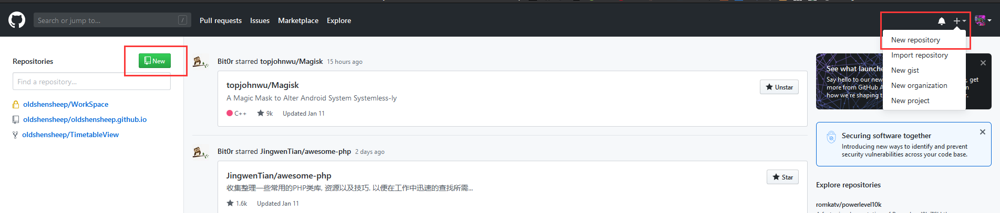
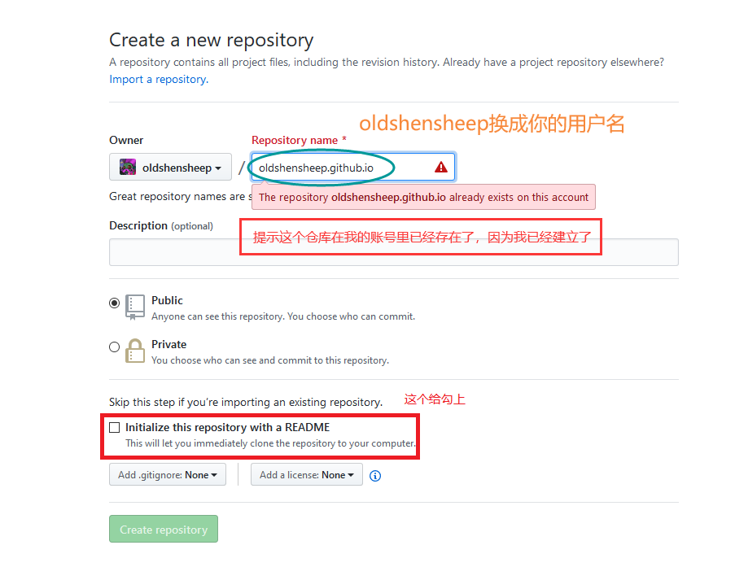
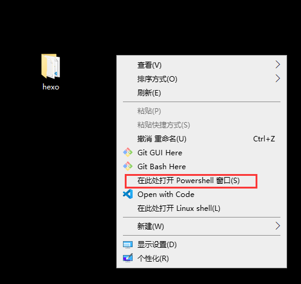
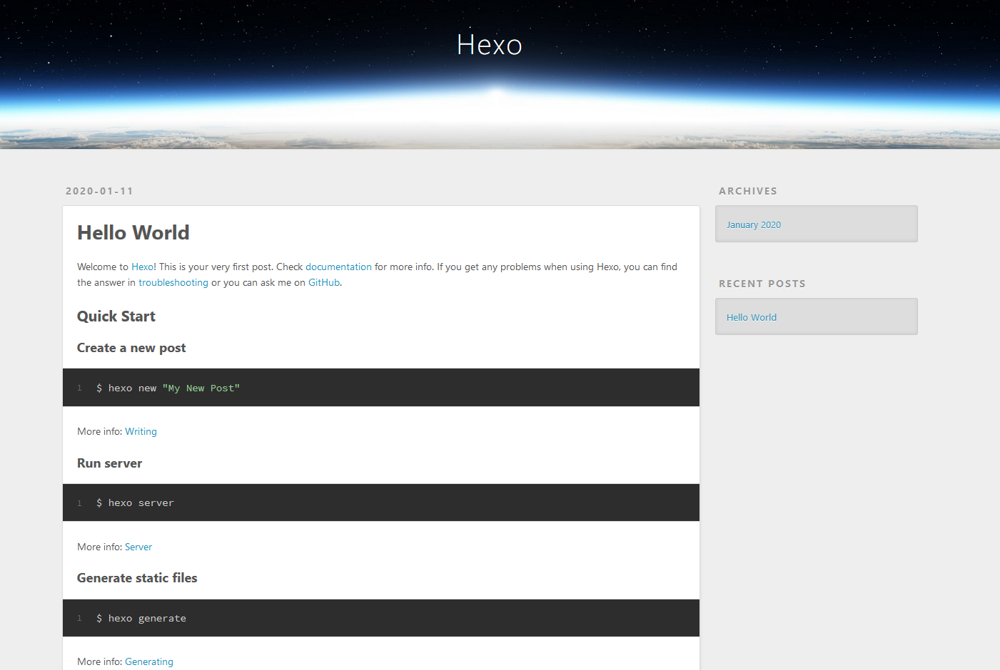

用 github 和 hexo 创建一个属于自己的 blog 网站

<!-- more -->

本文章是在 Windows 环境下完成的。  
如果认真看完了这个教程还是不会做，那……

## 建立一个 github 账号

点击进入网站注册 <https://github.com>

## 建立一个仓库（repository）

第一步，点击新建按钮  

第二步，创建仓库  


## 下载安装 git

点击下载 git <https://git-scm.com/download/win>  
国内下载可能比较慢，淘宝镜像地址 <https://npm.taobao.org/mirrors/git-for-windows/v2.24.1.windows.2/Git-2.24.1.2-64-bit.exe>  
安装一路下一步就行了

## 下载安装 nodejs

点击下载安装 nodejs <https://nodejs.org/dist/v12.14.1/node-v12.14.1-x64.msi>  
下一步，下一步，下一步（你安装国内的一些软件可不能这样哦）

## 安装 hexo

在某个地方新建一个文件夹，这个文件夹是储存你网站相关的文件的  
有个小技巧：  
这里我把文件夹建在了桌面，在空白处按 Shift 然后鼠标右键可以快捷在此处打开 Powershell  

在 cmd/PowerShell 输入

```bash
cmd
npm install -g hexo-cli
cd #你新建文件夹的名字
hexo init
```

## 部署到 github

安装部署工具

```bash
npm install hexo-deployer-git --save
```

先编辑一下 hexo 文件夹里的\_config.yml 这个配置文件，在底部添加

```yml
deploy:
    type: git
    repo: https://github.com/oldshensheep/oldshensheep.github.io # oldshensheep换成你的用户名就行了
    branch: master
```

然后在刚才的 powershell 窗口输入

```bash
git config --global user.email "you@example.com"
git config --global user.name "Your Name"
hexo g && hexo d
```

应该会有一个窗口弹出，输入 github 账号信息即可。  
这样应该就完成了部署。访问 用户名.github.io  
应该会看到这样的画面  


## 写文章&发布

输入

```bash
hexo new title
```

在 hexo/\_posts 目录下面有个 title.md 文件  
编辑这个文件就可以开始写文章了，但是你可能要去学习一下 md 的语法。但比较简单百度一下就可以搜得到，便不多说。  
发布输入下面的命令就可以啦

```bash
hexo g && hexo d
```

## 其它

官方指南 <https://hexo.io/zh-cn/docs/>  
有不清楚的对方可以看看  
建议多看看，上面网站对你应该有很大帮助。  
有主题可以让你的网站看起来更美观，还可以添加评论功能等等，我就带你到此了。
