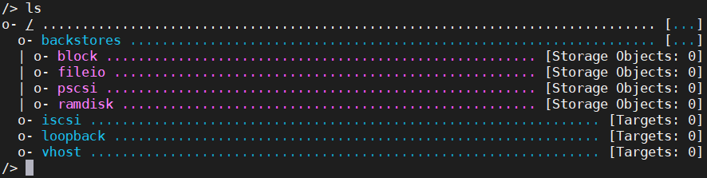
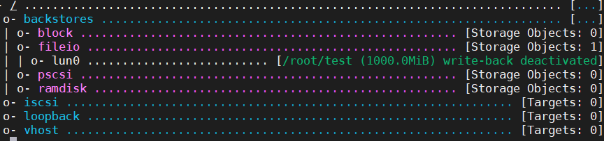
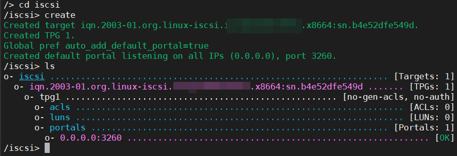

如何在 Linux 上创建一个 ISCSI 服务器？如何用不同的存储介质作为后端存储？
因为一次黑群晖系统挂了，所以就学习了这个技能来解决这个问题。后来也就抛弃黑群晖了，黑群晖是真的香，但是有时候不怎么稳定，而且不像 Ubuntu 那样可以自由的安装各种软件。

<!-- more -->

## 安装方法&系统环境

Debian 及其衍生出来的系统，如 Ubuntu，Deepin 等，我是用 Ubuntu 18.04 LTS。

### 安装 targetcli-fb

```bash
sudo apt update
sudo apt install targetcli-fb
```

## 标题

命令有两种模式，一种是交互式模式，一种是命令行模式。这里用的是交互模式。
输入 targetcli 就可以进入命令行模式了。
进入交互式模式可以使用 ls,pwd,cd 等命令。

按 2 次 TAB 键可以查看所有可用的命令，在每个目录下都可以通过这种方式查看可用的命令


-   block 块设备
-   fileio 文件
-   pscsi 物理 SCSI
-   ramdisk 内存

### 创建后端存储的文件

这里我们用一个文件做后端存储就行了，因为在写 blog 之前数据已经提取出来了这里演示就创建一个空白文件。
创建一个 1G 的文件

```bash
dd if=/dev/zero of=test bs=1M count=1000
```

### 创建后端存储

进入 targetcli 控制台输入

```bash
cd backstores/fileio # 这里按TAB会有提示不必一个个字母输入
create lun0 /root/test # 创建一个名为 lun0 的后端存储
```

回到根目录输入

```bash
cd /
ls
```



### 创建 ISCSI target

```bash
cd iscsi
create #create命令后面不加参数会创建一个随机iqn的target
#自己手动命名  create iqn.2020-01.com.oldshensheep.iscsi:ubuntu.tgt1
ls #查看创建的情况
```



### 将后端存储和 iscsi target 关联

```bash
cd iqn.2003-01.org.linux-iscsi.*************.x8664:sn.b4e52dfe549d/tpg1/luns
create /backstores/fileio/lun0
```

### 在 windows 上连接

在 Windosw 上打开 ISCSI 发起程序输入 IP 发现就可以了
这个是没有密码保护的要注意安全性，在参考文章中有比较详细的说明如何添加密码认证

## 参考

<https://www.cnblogs.com/pipci/p/11620234.html>  
<https://www.cnblogs.com/luxiaodai/p/9851214.html>
