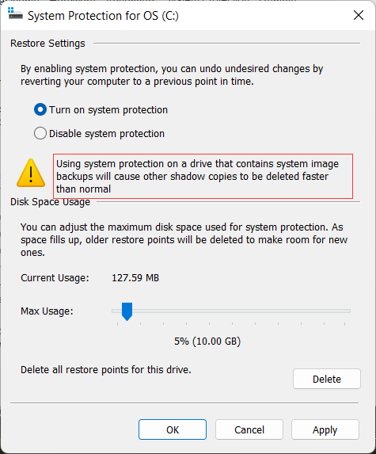
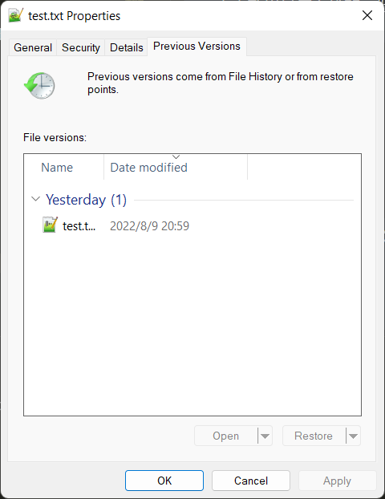

Windows 也有快照？真的是文件系统的快照？还可以通过系统自带的文件历史还原？

<!-- more -->

## 新建快照

Windows 称之为 Volume Shadow Copy (VSS)

Windows 的快照是通过 Copy On Write 实现的，众所周知对性能有一定影响。

### 关闭系统还原点功能

新建快照是**不需要**开启系统还原点功能的！  
开启还原点功能会导致老的快照更快的被删除，因为快照占用的空间是有限的，而还原点会占用大量的快照空间，快照空间不足就会删除旧的快照，所以最好把还原点功能关闭了。



### 新建一个快照

新建一个文件测试一下快照
在 HOME 目录下新建一个内容为 100 的 test.txt 文件

```powershell
❯ 100 > test.txt
❯ cat .\test.txt
100
```

创建一个 C 盘的快照，注意我这里用了 sudo 表明需要管理员权限。

```cmd
❯ sudo wmic shadowcopy call create Volume=C:\
Executing (Win32_ShadowCopy)->create()
Method execution successful.
Out Parameters:
instance of __PARAMETERS
{
        ReturnValue = 0;
        ShadowID = "{57587129-D224-4E21-BC36-4C3D9B1DFDC7}";
};
```

快照就成功建立了！  
看看效果是怎么样的，把之前新建得到 ~/test.txt 的内容修改为 101 试试。

```powershell
❯ 101 > ~/test.txt
❯ cat ~/test.txt
101
```

## 恢复指定文件/文件夹

在文件管理器打开这个文件的属性，可以打开和恢复到之前的版本。


查看文件发现恢复到之前的状态了。

```powershell
❯ cat ~/test.txt
100
```

## 删除快照

vssadmin 可以操作快照，支持以下命令，注意把命令换成小写开头。  
如`vssadmin delete shadows`而不是`vssadmin Delete Shadows`，输入命令会有帮助文档。

```powershell
❯ vssadmin
vssadmin 1.1 - Volume Shadow Copy Service administrative command-line tool
(C) Copyright 2001-2013 Microsoft Corp.

Error: Invalid command.

---- Commands Supported ----

Delete Shadows        - Delete volume shadow copies
List Providers        - List registered volume shadow copy providers
List Shadows          - List existing volume shadow copies
List ShadowStorage    - List volume shadow copy storage associations
List Volumes          - List volumes eligible for shadow copies
List Writers          - List subscribed volume shadow copy writers
Resize ShadowStorage  - Resize a volume shadow copy storage association
```

删除 C 盘的所有快照

```powershell
❯ sudo vssadmin  delete shadows /for=C:
vssadmin 1.1 - Volume Shadow Copy Service administrative command-line tool
(C) Copyright 2001-2013 Microsoft Corp.

Do you really want to delete 3 shadow copies (Y/N): [N]? Y

Successfully deleted 3 shadow copies.
```

## 方便的浏览快照

<https://www.nirsoft.net/utils/shadow_copy_view.html>  
这个软件  
可以浏览任意一个快照的内容  
可以方便的在文件管理器打开当前快照  
可以……

## 总结

2 个命令`wmic shadowcopy call create Volume=C:\`和`vssadmin`

## FAQ

<https://docs.microsoft.com/en-us/windows-server/storage/file-server/volume-shadow-copy-service#frequently-asked-questions>

## 参考文档

<https://docs.microsoft.com/en-us/windows-server/storage/file-server/volume-shadow-copy-service>

<https://docs.microsoft.com/en-us/windows-server/administration/windows-commands/vssadmin-delete-shadows>

<https://www.windowsphoneinfo.com/threads/schedule-shadow-copy-problem-wmic.529068/>
