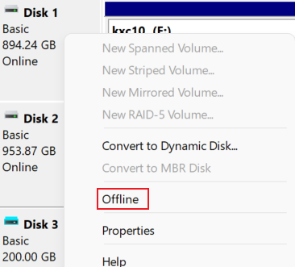

这个让ZFS工作在Windows上的[项目](https://github.com/openzfsonwindows/openzfs)还不太稳定，经常蓝屏，便寻求其他解决方案，于是乎。

<!-- more -->

写这个文章的时候使用的是ArchLinux的WSL2，为了使教程更简单，也为了从0实现，这篇文章使用Ubuntu22.04版本进行测试。

## 先决条件
安装WSL2版本的 Ubuntu22.04，其他的系统版本应当也可。
具体安装方法参考官方文档。

对于系统版本大于Windows 10 version 2004或者Windows11的用户参考下面的文档：
https://docs.microsoft.com/en-us/windows/wsl/install

对于系统版本大于 Version 1903 的参考下面的文档：
https://docs.microsoft.com/en-us/windows/wsl/install-manual

## 替换WSL的Linux Kernel
参考文档[^1]

在此 https://github.com/oldshensheep/zfs-on-wsl/releases 下载编译好的支持ZFS的Kernel，下载bzImage，放到 **Windows** 的一个地方。
然后在PowerShell窗口中执行以下命令：
注意吧`<bzImage Path>`替换成你下载的bzImage的路径，例如`C:\\Fun\\bzImage`
```
"
[wsl2]
kernel=<bzImage Path>
" > ~/.wslconfig
```

然后`wsl --shutdown`关闭运行中的实例，然后重新启动Ubuntu。


### 挂载硬盘到WSL2

Windows版本必须是Windows 11 Build 22000及更新版本，否则无法挂载硬盘（官方文档如此，未测试）。挂载USB硬盘是支持的，但是U盘不支持，不过可以直接挂载USB设备到Linux[^2]，暂未测试。


在PowerShell中执行，获取可用的磁盘
```pwsh
GET-CimInstance -query "SELECT * from Win32_DiskDrive"
```
应该会输出类似的结果：
```
DeviceID           Caption                              Partitions Size          Model
--------           -------                              ---------- ----          -----
\\.\PHYSICALDRIVE3 Microsoft Virtual Disk               1          214745610240  Microsoft Virtual Disk
\\.\PHYSICALDRIVE4 Seagate BUP Slim BK SCSI Disk Device 2          1000202273280 Seagate BUP Slim BK SCSI Disk Device
\\.\PHYSICALDRIVE1 KIOXIA-EXCERIA SATA SSD              1          960194511360  KIOXIA-EXCERIA SATA SSD
\\.\PHYSICALDRIVE2 HS-SSD-C2000Pro 1024G                1          1024203640320 HS-SSD-C2000Pro 1024G
\\.\PHYSICALDRIVE0 KINGSTON RBUSNS8180S3256GJ           3          256052966400  KINGSTON RBUSNS8180S3256GJ
```
打开Windows的磁盘管理，选择要挂载到Linux的磁盘，点击Offline。（U盘可能无法Offline，但是通过WSL2连接USB设备可能可行，https://docs.microsoft.com/en-us/windows/wsl/connect-usb）


这里我使用的是一个移动硬盘，路径是`\\.\PHYSICALDRIVE4`，Offline后
在PowerShell中执行（需要管理员权限）
```pwsh
wsl --mount \\.\PHYSICALDRIVE4 --bare
```
在WSL2中运行`sudo lsblk`查看是否挂载成功，如果挂载成功，则会输出：
```bash
sheep@sheep-laptop ~> sudo lsblk
NAME   MAJ:MIN RM   SIZE RO TYPE MOUNTPOINTS
sda      8:0    0 339.7M  1 disk
sdb      8:16   0   256G  0 disk /
sdc      8:32   0 931.5G  0 disk
├─sdc1   8:33   0 931.5G  0 part
└─sdc9   8:41   0     8M  0 part
```

## 配置ZFS
这里不会过多讲述如何使用ZFS，请参考其他文档。


在Ubuntu中安装zfsutils-linux
```bash
sudo apt install zfsutils-linux 
```
安装完成后输入`sudo zfs version`查看是否安装成功，成功会输出：
```bash
sheep@sheep-laptop ~> sudo zfs version
zfs-2.1.4-0ubuntu0.1
zfs-kmod-2.1.5-1
```
`zfs-kmod-2.1.5-1`是内核中的ZFS模块，在bzImage内

`zfs-2.1.4-0ubuntu0.1`是安装的管理工具。版本差别过大可能有BUG。

创建一个ZFS。`cannot label 'sdb': failed to detect device partitions on '/dev/sdb1': 19` 这个错误不会影响程序的运行，可以忽略。
```bash
root@sheep-laptop /h/sheep# lsblk
NAME   MAJ:MIN RM   SIZE RO TYPE MOUNTPOINTS
sda      8:0    0 339.7M  1 disk
sdb      8:16   0 931.5G  0 disk
├─sdb1   8:17   0 931.5G  0 part
└─sdb2   8:18   0     8M  0 part
sdc      8:32   0   256G  0 disk /
root@sheep-laptop /h/sheep# zpool create new-pool /dev/sdb
cannot label 'sdb': failed to detect device partitions on '/dev/sdb1': 19
root@sheep-laptop /h/sheep [1]#
```
创建一个文件测试一下
```bash
root@sheep-laptop /h/sheep [1]# ls /new-pool/
root@sheep-laptop /h/sheep# echo "hello zfs" > /new-pool/hello
root@sheep-laptop /h/sheep# cat /new-pool/hello
hello zfs
root@sheep-laptop /h/sheep# ls /new-pool/
hello
root@sheep-laptop /h/sheep#
```
成功！

然后你可以在WSL2里安装samba作为SMB文件服务器，让Windows使用。简单的参考文档https://ubuntu.com/tutorials/install-and-configure-samba

## 重启重新配置
1. 获取可用的磁盘
    ```pwsh
    GET-CimInstance -query "SELECT * from Win32_DiskDrive"
    ```
2. 挂载磁盘
    ```pwsh
    wsl --mount \\.\PHYSICALDRIVE* --bare
    ```
3. 在Linux中导入zpool（如果你第二步在启动WSL2前执行，这步可以省略）
   ```bash
   zpool import <pool-name>
   ```
## 关于ZFS的参考文档
ZFS documentation: https://openzfs.github.io/openzfs-docs/  
zfs deduplication https://linuxhint.com/zfs-deduplication/  
zfs compression https://linuxhint.com/enable-zfs-compression/  


[^1]: https://docs.microsoft.com/en-us/windows/wsl/wsl-config
[^2]: https://docs.microsoft.com/en-us/windows/wsl/wsl2-mount-disk
